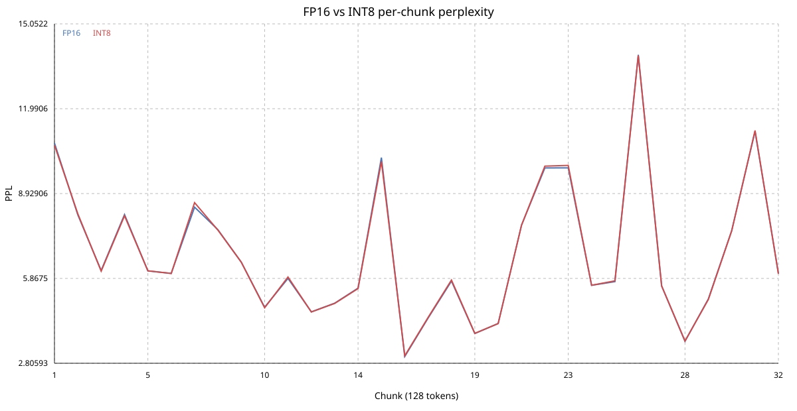

# CUDA W8A16 quantization

This directory contains the CUDA W8A16 implementation used by the backend. The
`rwkv_quantize` tool converts a BF16 RWKV checkpoint into a streaming `.rwkvq`
archive. Linear tensors use per-output-channel symmetric INT8 weights with one
FP16 scale per output row; embeddings, layer norms, LoRA factors, and other
non-linear tensors remain BF16.

The CUDA backend detects `.rwkvq` files automatically. INT8 weights stay on the
device and use W8A16 GEMV/GEMM for attention projections, FFN projections, and
the output head. Runtime tuning selects split-K and batched kernel variants per
GPU/model shape and persists the result in the `--tune-cache` file. HIP builds
continue to use the BF16/PTH path.

## Measured result

The final measurement used an NVIDIA GeForce RTX 4060 Ti 16 GB (`sm_89`) with
the RWKV7 G1J 7.2B, context-16K model. Decode timing used independent random
states, a 32-token prefill, three warmups, ten samples, and the median samples
5 and 6. W8A16 values below are cache-hit results after runtime tuning.

| Batch | FP16 ms | W8A16 ms | W8A16 TPS | TPS gain |
|---:|---:|---:|---:|---:|
| 1 | 38.0691 | 20.6220 | 48.4919 | +84.6043% |
| 2 | 39.9039 | 21.8185 | 91.6653 | +82.8902% |
| 4 | 43.6685 | 24.2293 | 165.0894 | +80.2301% |
| 8 | 46.1859 | 24.8054 | 322.5104 | +86.1929% |
| 16 | 56.0823 | 28.6889 | 557.7070 | +95.4843% |
| 32 | 58.8945 | 33.8133 | 946.3732 | +74.1755% |
| 64 | 65.8202 | 40.7663 | 1569.9242 | +61.4574% |

W8A16 is faster at every measured batch. Decode time is reduced by 38.1--48.8%
and actual throughput increases by 61.5--95.5%. The largest relative gain is
at batch 16; the largest absolute throughput is at batch 64.

For the 1024-token, chunk-128 prefill gate, FP16 measured 512.869 ms and W8A16
measured 450.836 ms. W8A16 was 12.09% faster (0.8786x the FP16 time).

## Accuracy and generation difference

Teacher-forced logits were evaluated on the same token sequence, so sampled
divergence could not contaminate the comparison. Across 54 positions, logit MSE
was `0.02647262`, RMSE was `0.16270409`, and the top-1 token matched on 53/54
positions (`98.15%`). This is numerical approximation rather than bitwise FP16
equivalence.

The 16K long-context checks showed no monotonic error accumulation:

| Input sequence | Mean MSE at 16K | Top-1 equal |
|---|---:|---:|
| Fixed random tokens | 0.01005010 | 15,579/16,384 (95.09%) |
| Real English prose | 0.05523100 | 15,947/16,384 (97.34%) |

On the deterministic Chinese corpus, perplexity was `6.385901313` for FP16 and
`6.391733437` for W8A16: absolute difference `0.005832123`, relative difference
`0.091328%`.

The same greedy HTTP request was also sent to sequential FP16 and W8A16
services. Character-level agreement over 64 generated tokens was:

| Prompt | Character agreement |
|---|---:|
| Chinese matrix explanation | 1.000 |
| English sky explanation | 0.064 |
| C++ explanation | 0.689 |

Autoregressive text can diverge after the first small numerical difference, so
these values are an output-stability observation rather than a direct quality
score. The teacher-forced logit and PPL measurements above are the controlled
degradation indicators.

## Archived plots

### Random-token 16K logit MSE

### Real-text 16K logit MSE

### Chinese PPL chunk distribution

Reproducible benchmark and calibration programs remain under `tools/` and are
built by the CUDA section of the top-level `CMakeLists.txt`.
